# Screenshots

A visual walkthrough of Campus Connect — covering both the student and admin experience, and the underlying database structure.

---

## Authentication

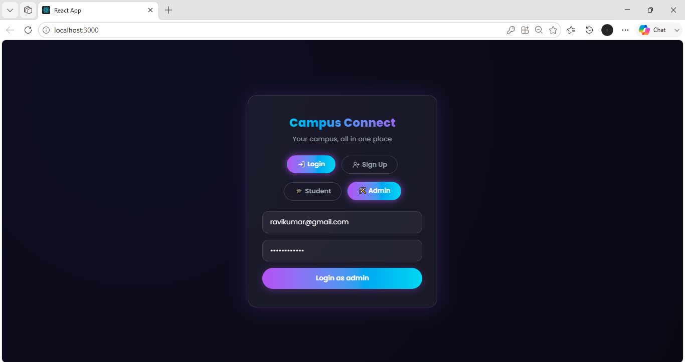

The entry point for all users. Students and admins authenticate through the same screen with role selection built in. On successful login, a JWT is issued and stored in localStorage to persist the session.

---

## Student Experience

### Home Dashboard

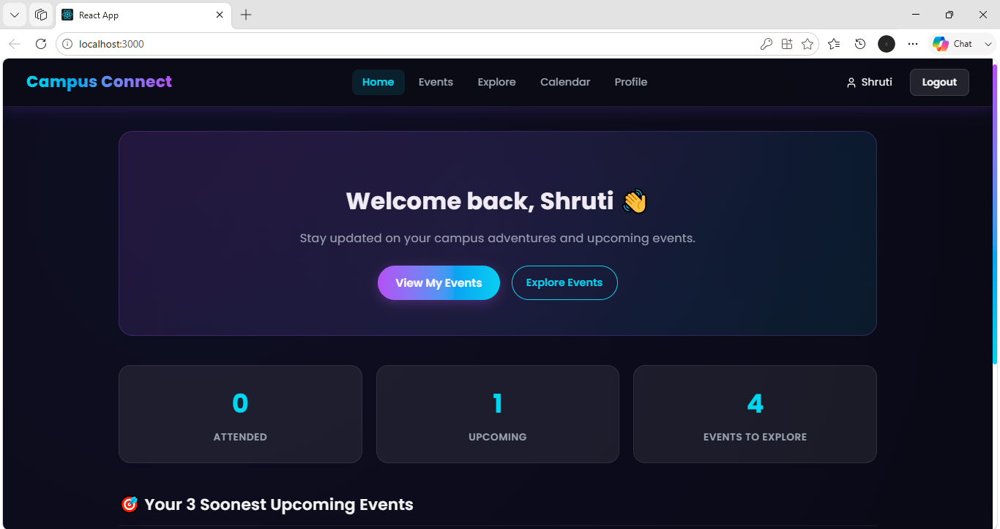

The student dashboard shows a personalized summary — events attended, upcoming RSVPs, and total events available on the platform. The three soonest upcoming events are listed below the stats for quick access.

---

### Events Page

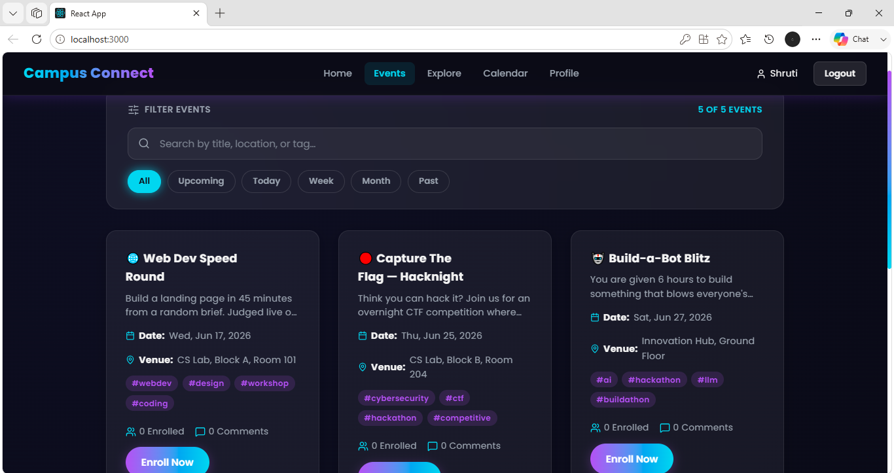

All campus events are displayed here with full-text search across title, location, and tags. Time-based filters (Upcoming, Today, This Week, This Month, Past) let students narrow down what's relevant to them. Each card shows the date, venue, tags, enrolled count, and comment count at a glance.

---

### Event Discussion

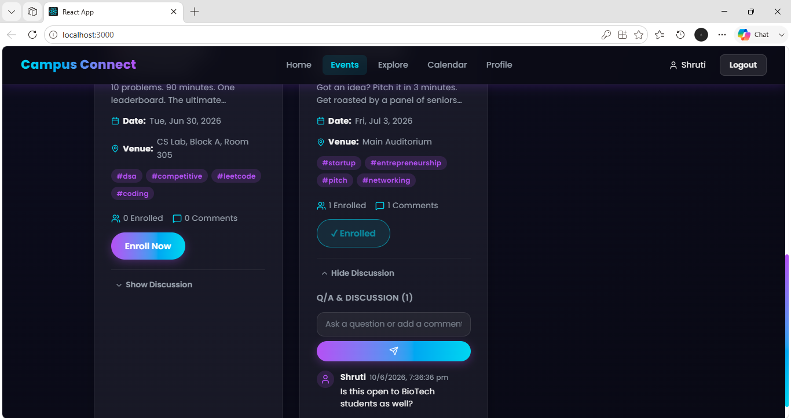

Each event card expands to reveal a Q&A and discussion thread. Students can post questions or comments, and see replies from others. The enrolled state is reflected on the button — toggling between Enroll Now and Enrolled.

---

### Calendar View

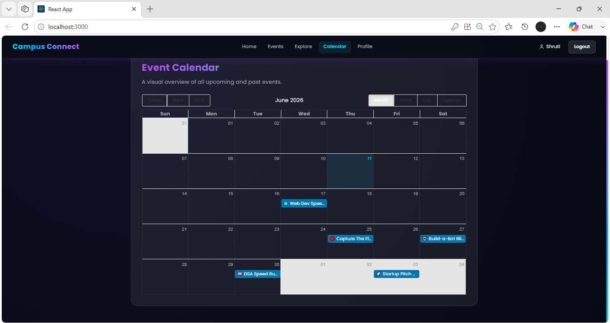

All events are plotted on an interactive monthly calendar using react-big-calendar. Students can switch between month, week, and day views, giving a clear picture of what's coming up across the semester.

---

### Profile Page

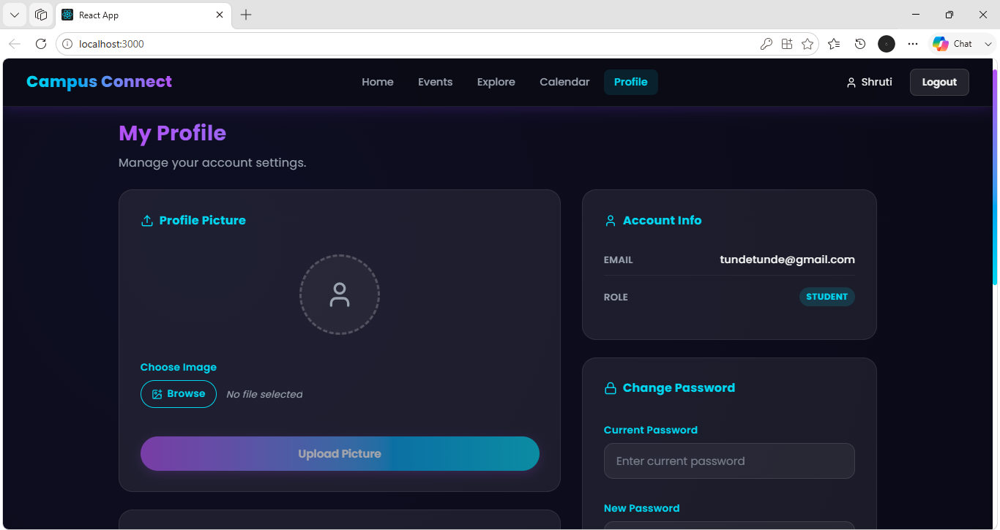

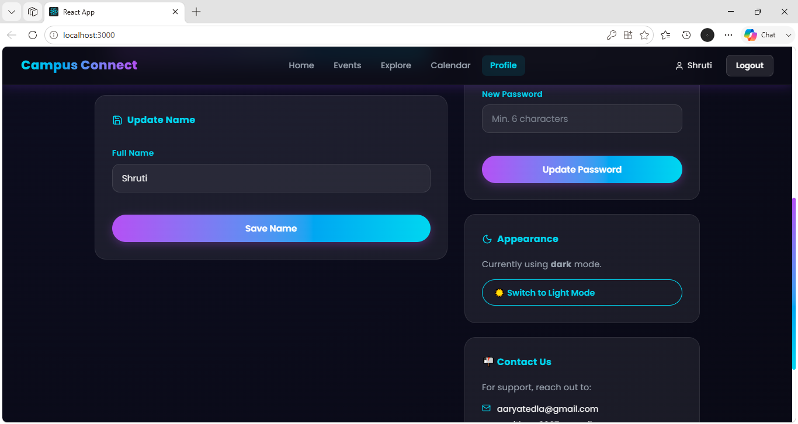

Students can upload a profile picture, update their display name, and change their password from this page. The appearance section lets them toggle between dark and light mode, with the preference saved to localStorage.

---

## Admin Experience

### Admin Dashboard

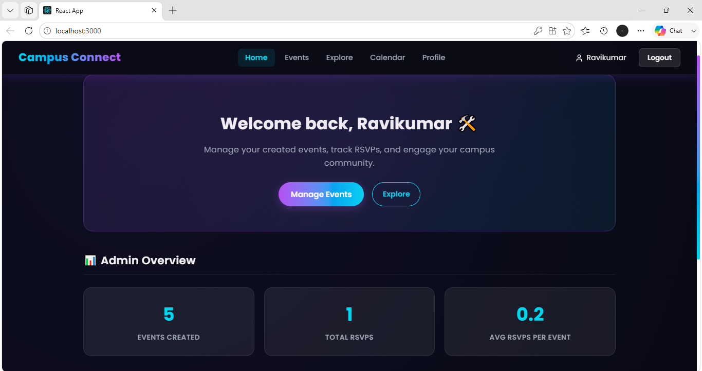

The admin home shows platform-wide engagement metrics — total events created, total RSVPs across all events, and the average RSVPs per event. This gives a quick read on how actively the student body is engaging with campus events.

---

### Create Event

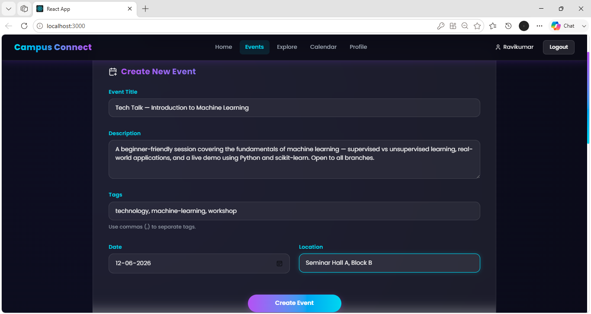

Admins can create events with a title, description, date, location, and comma-separated tags. The same form is reused for editing existing events, pre-populated with the current values.

---

### User Directory

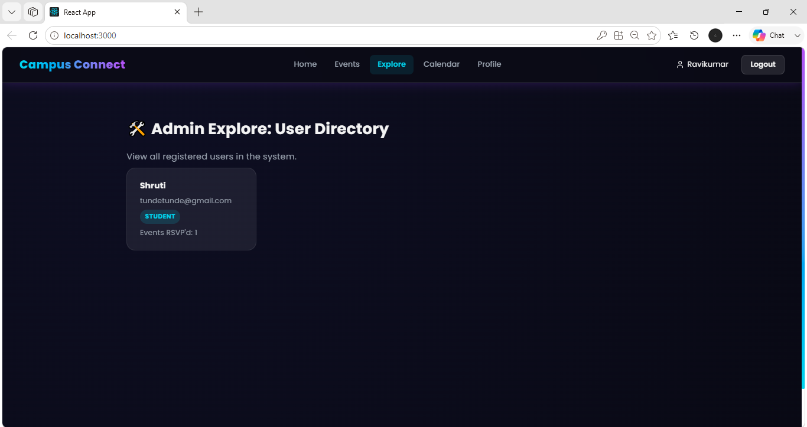

The Explore page for admins shows every registered student — their name, email, role badge, and how many events they've RSVP'd to. This is restricted to admins only via server-side role checking on the `/api/users` endpoint.

---

### Admin Profile

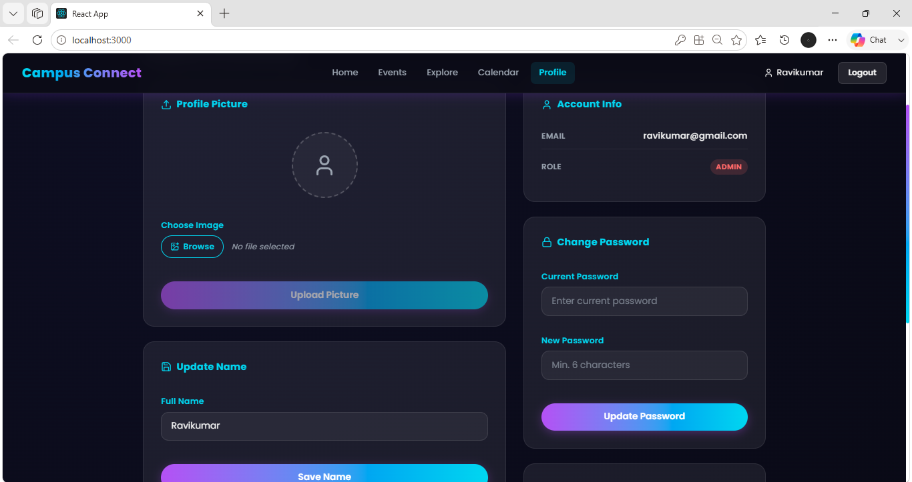

Admins have the same profile management options — picture upload, name update, and password change. The role badge displays as ADMIN instead of STUDENT.

---

## Database — MongoDB Compass

### Collections Overview

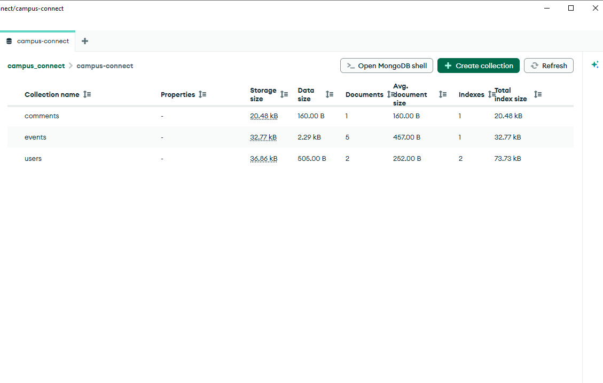

The database has three collections: `users`, `events`, and `comments`. Each is kept lean — comments are stored separately and reference their parent event and author by ObjectId, rather than being embedded inside the event document. This makes cascade deletion straightforward and keeps event documents from growing unbounded.

---

### Events Collection

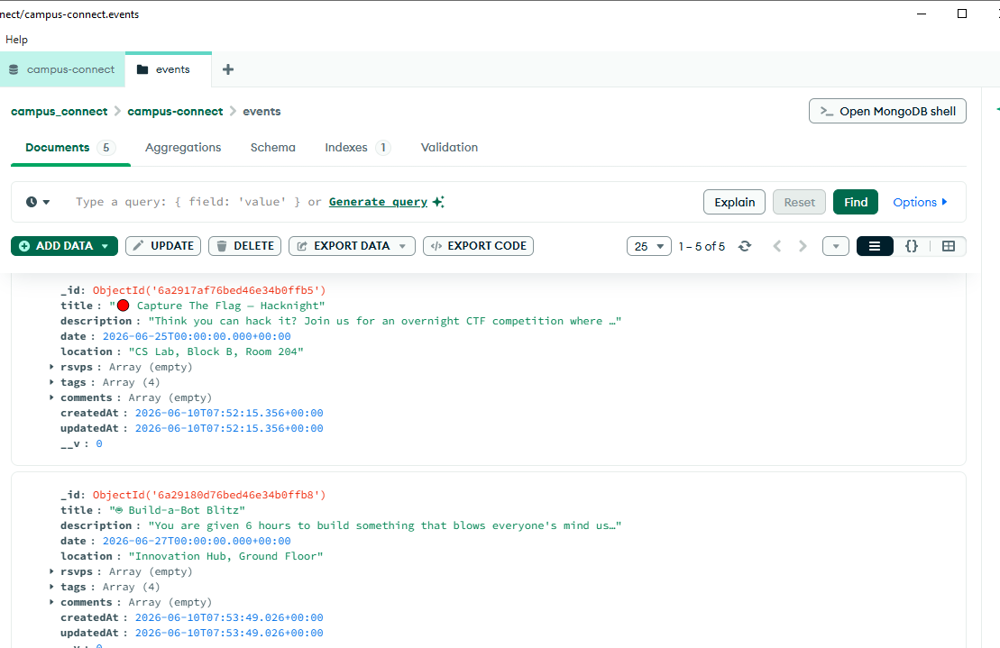

Each event document stores the title, description, date, location, tags array, and an rsvps array of user ObjectIds. Comments are stored in their own collection and linked by event ID rather than nested here.

---

### Users Collection

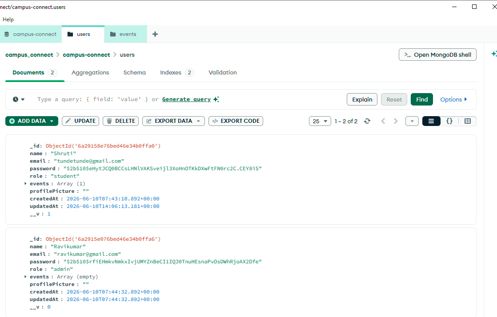

User documents store the name, email, hashed password (bcrypt), role, and an array of event ObjectIds the user has RSVP'd to. Passwords are never stored in plaintext — the hash visible here is a bcrypt hash with a cost factor of 10.

---

### Comments Collection

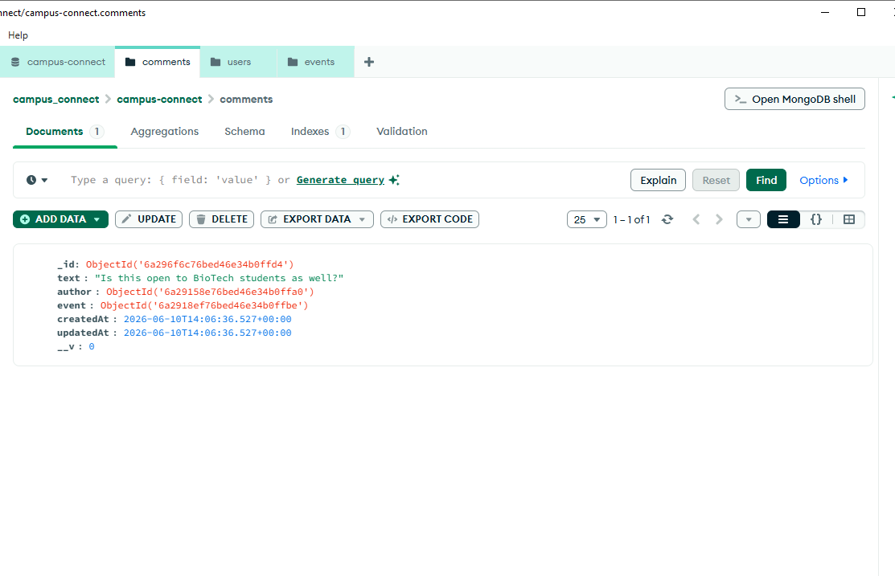

Each comment stores the text, a reference to the author (user ObjectId), and a reference to the event it belongs to. When an admin deletes an event, all comments with that event ID are deleted from this collection in the same operation to avoid orphaned documents.

---

*All screenshots taken during local development with sample data.*
